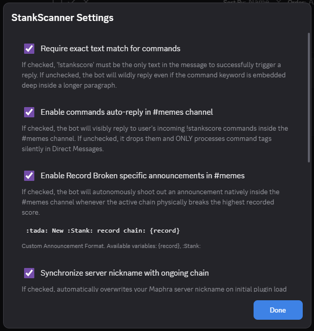
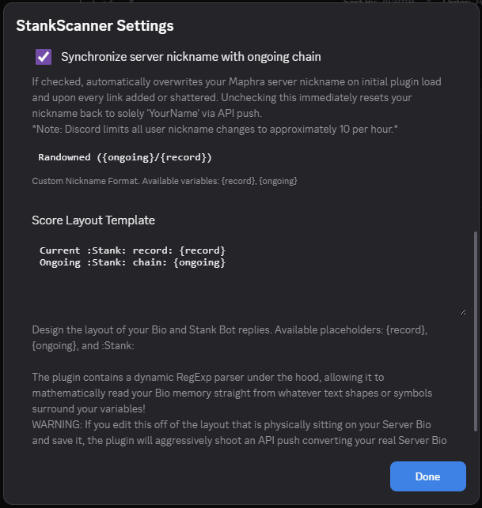

# StankScanner

**StankScanner** is a custom [BetterDiscord](https://betterdiscord.app/) plugin built specifically for tracking community sticker chains in the [Maphra Discord Server](https://discord.gg/maphra).

It actively listens to the `#maphra-worship` channel for "Stank" sticker chains and updates the Server Bio and your Nickname dynamically when a new record is broken!

## 🌟 Features

- **Chain Tracking**: Calculates the longest unbroken chain of purely "Stank" stickers sent by unique users.
- **Dynamic Updates**: Automatically updates your Server Bio and Server Nickname (e.g. `Randowned ({ongoing}/{record})`) with the current scores.
- **Auto-Reply Listener**: Listens for the command `!stankscore` sends the current scores in a customizable template both in DMs or in #memes channel if enabled.
- **Customziation & Settings**: Enable/disable #memes channel interactions. Customize message and Bio templates.

 

## 🚀 Installation for BetterDiscord

This plugin is exclusively built for **BetterDiscord**. You must be using the Discord Desktop client.

1. Download and install [BetterDiscord](https://betterdiscord.app/).
2. Open Discord and click the gear icon to open **User Settings**.
3. Scroll down the left sidebar to the **BetterDiscord** section and click on **Plugins**.
4. Click the **"Open Plugins Folder"** button at the top to open `%appdata%\BetterDiscord\plugins`.
5. Download `StankScanner.plugin.js` from this repository and drop it into that plugins folder.
6. Return to the **Plugins** menu in Discord—you should see **StankScanner** appear in the list.
7. Toggle the switch to **Enable** it!

## ⚠️ Important

> **Self-Bot Warning:** Automatically replying to other users (the Auto-Reply Listener ping feature) relies on your user account sending API requests without manual keyboard input, which goes against Discord's standard TOS regarding self-bots. Use such features at your own risk.

---

*Developed for the Maphra Discord Community.*
